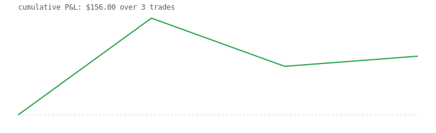

# odte-spy-bot — Live Dashboard

*Generated 2026-07-08 16:00 ET · auto-updated at each session close · **LIVE pre-registered evidence only** — historical exploration lives in [AI_REVIEW.md](../AI_REVIEW.md) and is never mixed into this page.*

> Context: the historical harness says this strategy is NEGATIVE under pessimistic fill assumptions (~−$8.6/trade). The open question this page answers over time: **do real fills beat that model?**

## Bottom line — plain English

### 🟢 On track — no death-spiral signal, fills not (yet) confirming the bad case.

Fills are landing near mid (~$-0.05/trade of slippage) — the GOOD case; real fills are beating the pessimistic model. This is the only path to survival.

*So far: 3 trades · net $156.00 · kill-watch: insufficient.*

**What to do:** Nothing. Let the evidence accumulate; the bot kills itself early if it turns.

## Early-warning — strategy death-spiral monitor

**⚪ INSUFFICIENT DATA** · n=3 < 30: too few closed trades to judge; keep accumulating.

| Closed trades | $/trade | 95% CI | Consec. losing sessions | Mean slippage |
|---|---|---|---|---|
| 3 | $52.00 | [$-128.00, $257.00] | 0 | $-0.046 |

## Live results (paper)

| Trades | Win rate | Profit factor | $/trade | Total P&L |
|---|---|---|---|---|
| 3 | 66.7% | 2.22 | $52.00 | $156.00 |

_n=3 < 30 — treat every number above as noise._

## Fill quality — the decisive evidence

| Metric | n | Mean | Verdict (protocol thresholds) |
|---|---|---|---|
| Entry slippage (est − fill) | 3 | -0.046 | **v1-ish (optimistic fills confirmed)** |
| Exit slippage — limit | 0 | — | no data |
| Exit slippage — market | 0 | — | no data |

## Pre-registered experiments — progress toward decision n

| Hypothesis | Groups (n so far) | Decision at |
|---|---|---|
| H2b width A/B | $5: 1 · $10: 2 | ≥50/arm |
| H1 IV/RV | IV>1.2×RV: 3 · rest: 0 | ≥60/group |
| H3 limit-vs-market exits | limit: 0 · market: 0 | ≥50 limit |
| H7 GEX regime | GEX+: 0 · GEX−: 0 | ≥60/group |
| H8 touch-prob EV | logged: 3 | ≥60/group |
| H9 skew regime | logged: 0 | ≥60/group |
| H10 cost meta-labeler (shadow) | logged: 3 · mean P(bad-fill): 0.50 | ≥100 to train, then holdout |
| H4 profit target | queued (starts after H2b) | — |

**Holdout integrity:** reserved 2025-01-02..2025-06-30 · confirmatory looks consumed: 0 (none — untouched)

## Recent trades (last 15)

| Opened | Kind | W | Credit est→fill | Exit | Cost est→fill | P&L | GEX |
|---|---|---|---|---|---|---|---|
| 2026-07-08T10:52 | bull_put | 10 | 0.84→0.90 | take_profit | 0.45→— | 257.00 | — |
| 2026-07-08T12:43 | bear_call | 10 | 0.62→0.72 | flatten | 0.58→— | -128.00 | — |
| 2026-07-08T13:09 | bear_call | 5 | 0.26→0.23 | take_profit | 0.12→— | 27.00 | — |

## Standing kill rule (adopted R11)

At n ≥ 500 live trades: if the bootstrapped 95% CI upper bound of $/trade is below $0, the strategy family is retired — hard-coded commitment, no appeals to 'one more tweak'.

---
*Sources: `trades.db` (TradeLog) · protocol: [RESEARCH_PROTOCOL.md](../RESEARCH_PROTOCOL.md) · full research record: [AI_REVIEW.md](../AI_REVIEW.md) · system reference: [SYSTEM.md](../../SYSTEM.md)*